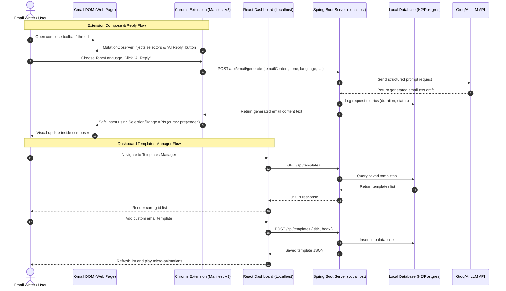

<div align="center">

# 💌 MailGenie
### Premium AI-Powered Email Writer, Templates Manager & Gmail Reply Assistant

Generate professional, context-aware, and personalized email replies in seconds — directly integrated inside Gmail, or standalone via a beautiful glassmorphic web dashboard.

---

[](https://www.oracle.com/java/)
[](https://spring.io/projects/spring-boot)
[](https://react.dev/)
[](https://mui.com/)
[](https://vite.dev/)
[](https://console.groq.com/)
[](https://developer.chrome.com/docs/extensions/)
[](./LICENSE)

<p align="center">
  
</p>

</div>

---

## 📖 Table of Contents
1. [✨ What is MailGenie?](#-what-is-mailgenie)
2. [🏗️ Architecture & Flow](#-architecture--flow)
3. [🚀 Key Features](#-key-features)
4. [🛠️ Tech Stack Details](#-tech-stack-details)
5. [📁 Codebase Map](#-codebase-map)
6. [⚙️ Complete Setup Guide](#-complete-setup-guide)
   - [Backend Configuration](#1-backend-configuration)
   - [React Frontend Installation](#2-react-frontend-installation)
   - [Chrome Extension Setup](#3-chrome-extension-setup)
7. [🔌 Custom LLM Configuration](#-custom-llm-configuration)
8. [📊 Metrics & Auditing Subsystem](#-metrics--auditing-subsystem)
9. [📂 Built-in Templates System](#-built-in-templates-system)
10. [🌐 API Reference](#-api-reference)
11. [🔒 Security Architecture](#-security-architecture)
12. [📜 Legal & Compliance](#-legal--compliance)
13. [🔧 Advanced Prompt Tuning](#-advanced-prompt-tuning)
14. [🚀 Production Deployment Guide](#-production-deployment-guide)
15. [❓ Troubleshooting & FAQ](#-troubleshooting--faq)
16. [🛣️ Roadmap](#-roadmap)
17. [📄 License](#-license)

---

## ✨ What is MailGenie?

MailGenie is a local-first, zero-trust, AI-powered email productivity suite consisting of three integrated modules:

*   🧠 **Spring Boot Backend**: A highly performant reactive server written in Java 17+ that interfaces with the Groq LPU inference API (using models like Llama 3.3 70B). It manages reply generation, customizable templates, and analytics auditing data.
*   ⚛️ **React Frontend**: A premium, glassmorphic standalone dashboard featuring real-time response time charting, a rich templates manager, connection configurations, and legal compliance pages.
*   🧩 **Chrome Extension (Manifest V3)**: A lightweight browser extension that injects tone, language, and template selectors alongside an **"AI Reply"** button directly into Gmail's compose and reply toolbars. It parses incoming email threads on-the-fly and automatically inserts generated drafts.

```
📧 Open Gmail thread or compose box
        ↓
🖱️ Select Tone, Language, or Template & click "AI Reply"
        ↓
🧠 Local backend queries Groq LLM API with context
        ↓
✍️ Draft is cleanly prepended/inserted into Gmail composer
        ↓
✅ Review, tweak, and send in seconds
```

---

## 🏗️ Architecture & Flow

The following diagram illustrates the interaction between Gmail, the browser extension, the local React dashboard, the Spring Boot API, and the remote Large Language Model (LLM) APIs.



---

## 🚀 Key Features

*   **Zero-Latency AI Reply Generation**: Leveraging Groq’s LPU (Language Processing Unit) architecture to deliver email drafts in under 1 second.
*   **Deep Gmail Integration**: Seamless DOM injection into active Compose and Reply dialogs using an automated, debounced `MutationObserver` layout.
*   **Dual Mode Operations**:
    *   **Reply Mode**: Auto-extracts the latest incoming email thread context to write a highly contextual response.
    *   **Compose Mode**: Uses your custom prompts/instructions inside the textbox as a guide to draft a new email from scratch.
*   **Multi-Provider LLM Support**: Configure and override settings to use Groq, OpenAI, Google Gemini, or Anthropic Claude.
*   **Robust Extension Recovery**: Resilient runtime guards that detect "Extension context invalidated" errors (common during updates/reloads) and guide the user to refresh the tab rather than crashing.
*   **Premium Glassmorphic Dashboard**: A state-of-the-art web interface built with custom CSS gradients, blur filters, interactive charts, and responsive viewport support.
*   **Rich Templates Manager**: Create, edit, and search through canned response templates that dynamically sync with the Gmail dropdown extension.
*   **Connection Auditing & Stats**: Standalone charting showing average generation times, successful calls, and error rates to keep track of your API consumption.
*   **Fully Local & Privacy-First**: Stash history and templates on your own machine. Your API credentials stay in local browser storage or environmental variables—never sent to cloud servers.

---

## 🛠️ Tech Stack Details

### Backend
*   **Java 17 / OpenJDK**: Modern, performant class library base.
*   **Spring Boot 3.x**: Microservices backbone with Spring WebFlux.
*   **H2 Database**: Embedded, file-based database for quick local setup (configurable to PostgreSQL or MySQL for production).
*   **Spring Data JPA**: Clean ORM mapping.
*   **Maven**: Dependency resolver and compiler.

### Frontend
*   **React 19**: Modern declarative UI library.
*   **Vite 6**: Ultra-fast frontend packager and developer server.
*   **Material UI 5 / 7**: Component library customized for high-end glassmorphic dark mode styling.
*   **Axios**: Connection layer.

### Chrome Extension
*   **Manifest V3**: Complies with the latest Chrome standards.
*   **Isolated JS Engine**: Secure script execution that does not conflict with Gmail's native codebase.
*   **Selection & Range APIs**: Prepend content securely into Gmail's contenteditable editor without destroying signatures or quotes.

---

## 📁 Codebase Map

The following map highlights the critical directory hierarchy and code modules in MailGenie:

```
MailGenie/
│
├── Backend/
│   └── email-writer-s/
│       ├── src/main/java/com/email/writer/
│       │   ├── EmailGeneratorController.java       # Handles email generation requests
│       │   ├── EmailGeneratorService.java          # Composes prompts and communicates with LLM APIs
│       │   ├── EmailRequest.java                   # DTO mapping input JSON
│       │   ├── EmailTemplate.java                  # JPA Entity for email templates
│       │   ├── EmailTemplateController.java        # REST Controller managing templates
│       │   ├── EmailTemplateRepository.java        # Spring Data CRUD Repository
│       │   ├── EmailTemplateService.java           # Business logic for templates
│       │   ├── TemplateInitializer.java            # Prefills database with default templates
│       │   └── EmailWriterSApplication.java        # Application entry point
│       │
│       ├── src/main/resources/
│       │   ├── application.properties              # Local credentials database config (git-ignored)
│       │   └── application.properties.example      # Shared template for setup reference
│       └── pom.xml                                 # Backend dependencies file
│
├── emailwriterextension/
│   ├── manifest.json                               # Manifest V3 extension configuration
│   ├── content.js                                  # Gmail DOM mutation and AI inject actions
│   ├── content.css                                 # Styles for injected buttons & dropdowns
│   ├── popup.html                                  # Settings override UI popover
│   ├── popup.js                                    # Stores local API keys and backend URLs
│   └── icons/                                      # Chrome extension icon sizes
│
├── frontend/
│   └── EmailwriterGenerator/
│       ├── src/
│       │   ├── components/
│       │   │   ├── Footer.jsx                      # Premium layout footer
│       │   │   └── MetricStats.jsx                 # Real-time statistics indicator
│       │   │
│       │   ├── pages/
│       │   │   ├── AboutPage.jsx                   # Project details page
│       │   │   ├── ContactPage.jsx                 # User feedback container
│       │   │   ├── GuidelinesPage.jsx              # AI prompt recommendations page
│       │   │   ├── HelpPage.jsx                    # Setup documentation pages
│       │   │   ├── TermsPage.jsx                   # Detailed usage policies
│       │   │   ├── PrivacyPage.jsx                 # Local-first privacy guidelines
│       │   │   └── SecurityPage.jsx                # Host-level firewall check list
│       │   │
│       │   ├── App.jsx                             # Main router & dashboard controller
│       │   ├── App.css                             # Glassmorphic themes styling
│       │   └── main.jsx                            # React bootstrap launcher
│       │
│       ├── package.json                            # Package dependencies file
│       └── vite.config.js                          # Vite configuration
│
├── run.bat                                         # Launcher script for Windows
├── LICENSE                                         # MIT License agreement
└── README.md                                       # Comprehensive documentation (You are here)
```

---

## ⚙️ Complete Setup Guide

Follow these steps to configure your local development environment.

### 1. Backend Configuration

#### Prerequisites
*   Ensure **Java Development Kit (JDK) 17** or higher is installed and added to your environmental variables path (`java -version`).
*   Ensure **Apache Maven** is installed (`mvn -version`).

#### Setting up Properties
1.  Navigate into the backend project root:
    ```bash
    cd Backend/email-writer-s
    ```
2.  Copy the example properties template into a local config:
    ```bash
    cp src/main/resources/application.properties.example src/main/resources/application.properties
    ```
3.  Open the newly created `src/main/resources/application.properties` and add your credentials:
    ```properties
    spring.application.name=email-writer-s

    # Groq API endpoint configuration
    groq.api.url=https://api.groq.com/openai/v1/chat/completions
    groq.api.key=gsk_your_groq_api_key_here

    # Database configuration (Local H2 file storage)
    spring.datasource.url=jdbc:h2:file:./data/mailgeniedb;DB_CLOSE_ON_EXIT=FALSE
    spring.datasource.driverClassName=org.h2.Driver
    spring.datasource.username=sa
    spring.datasource.password=
    spring.jpa.database-platform=org.hibernate.dialect.H2Dialect
    spring.h2.console.enabled=true
    spring.h2.console.path=/h2-console
    spring.jpa.hibernate.ddl-auto=update
    ```

#### Running the Backend
Run the Spring Boot application using Maven:
```bash
mvn spring-boot:run
```
Once you see the startup confirmation log in your console, the backend will be available at **`http://localhost:8080`**.
You can verify the connection by visiting the H2 Console: `http://localhost:8080/h2-console` (Leave password empty to log in).

---

### 2. React Frontend Installation

#### Prerequisites
*   Ensure **Node.js** (v18 or higher recommended) is installed on your computer.

#### Installation
1.  Navigate into the frontend project root:
    ```bash
    cd frontend/EmailwriterGenerator
    ```
2.  Install the required Node dependencies:
    ```bash
    npm install
    ```
3.  Start the local development server:
    ```bash
    npm run dev
    ```
4.  Open your browser and navigate to the local URL displayed (typically **`http://localhost:5173`**).

---

### 3. Chrome Extension Setup

1.  Open Google Chrome and navigate to: **`chrome://extensions`**
2.  In the top-right corner, toggle the **Developer mode** switch to **ON**.
3.  In the top-left corner, click the **Load unpacked** button.
4.  In the file selection window, select the **`emailwriterextension`** directory located in the root of the cloned repository.
5.  Pin the MailGenie extension to your toolbar.
6.  Click the extension icon to verify your configurations (You can override your default backend URL or configure direct API keys if desired).

---

## 🔌 Custom LLM Configuration

MailGenie is pre-configured to use Groq Llama models due to their incredibly fast inference speed, but the backend is designed to accept multi-provider payloads.

The backend controller parses incoming request payloads to determine the active provider:
```json
{
  "emailContent": "Can you provide the sales projection report by tomorrow morning?",
  "tone": "casual",
  "provider": "groq",
  "language": "French",
  "apiKey": "Optional custom override key"
}
```

Supported providers are:
1.  `groq` (default)
2.  `openai`
3.  `gemini`
4.  `claude`

You can change providers dynamically in the standalone frontend using the dropdown menus or by configuring your preference in the Chrome Extension's popup interface.

---

## 📊 Metrics & Auditing Subsystem

MailGenie comes equipped with a lightweight metrics collector. This database auditing layer records:
- The time taken to process each API reply.
- The outcome status (Success or Failure).
- The token length and model used.

The React frontend polls these analytics from `/api/metrics` to build real-time visual statistics:

| Parameter | Description |
|---|---|
| **Average Response Duration** | Track changes in API response times in milliseconds. |
| **Total Inferences** | Accumulator for successful drafts generated. |
| **Failures Count** | Count of error statuses to debug backend/API credential issues. |

---

## 📂 Built-in Templates System

The application comes preloaded with common business template types:
- **Acknowledgement**: Quickly confirm receipt of an email thread.
- **Request Information**: Ask for files, statuses, or clarification.
- **Follow-up**: Send polite check-ins for unanswered correspondence.
- **Meeting Invite**: Draft invitations with place/time placeholder tags.

### Creating custom templates
You can create custom templates directly in the standalone React dashboard. Saving a template updates the database, and the Chrome Extension automatically queries these database rows to populate the **📂 Template** dropdown inside your Gmail compose bar:

1. Click **Templates Manager** in the dashboard.
2. Click **Create Template**.
3. Provide a name and body text. Use tags like `{Name}` or `{Time}` for easy template styling.
4. The template is immediately available inside Gmail. Selecting it inside your composer instantly writes it out.

---

## 🌐 API Reference

### 1. Generate Email Reply
*   **Endpoint**: `POST /api/email/generate`
*   **Headers**: `Content-Type: application/json`
*   **Request Body**:
    ```json
    {
      "emailContent": "Hi, I wanted to follow up on the status of our project integration. Let me know when you have a moment.",
      "tone": "professional",
      "provider": "groq",
      "model": "llama3-8b-8192",
      "language": "English",
      "apiKey": "",
      "composeMode": false
    }
    ```
*   **Response** (Status `200 OK`):
    ```
    Hi, Thank you for reaching out. I am currently working on finalizing the project integration tasks and expect to share a comprehensive status update by tomorrow afternoon. Let me know if you would like to schedule a quick call to go over the details. Best regards.
    ```

### 2. Fetch Saved Templates
*   **Endpoint**: `GET /api/templates`
*   **Response** (Status `200 OK`):
    ```json
    [
      {
        "id": 1,
        "title": "Meeting Confirmation",
        "body": "Hi {Name},\n\nI would like to confirm our meeting scheduled for {Time}.\n\nLooking forward to speaking with you.\n\nBest regards,\n[Your Name]"
      }
    ]
    ```

### 3. Add Custom Template
*   **Endpoint**: `POST /api/templates`
*   **Headers**: `Content-Type: application/json`
*   **Request Body**:
    ```json
    {
      "title": "Quick Thanks",
      "body": "Hi {Name},\n\nThanks for your response. Appreciate the quick update!\n\nBest,\n[Your Name]"
    }
    ```
*   **Response** (Status `200 OK`):
    ```json
    {
      "id": 2,
      "title": "Quick Thanks",
      "body": "Hi {Name},\n\nThanks for your response. Appreciate the quick update!\n\nBest,\n[Your Name]"
    }
    ```

---

## 🔒 Security Architecture

MailGenie is designed with a **privacy-first, local-security architecture**:

1.  **Strict Local sandboxing**: The React app and Spring Boot servers only exchange data with your `localhost` loopback interface. There are no hosted cloud relays in the middle that intercept your text.
2.  **Manifest V3 Extension Isolation**: The Chrome Extension is built on Manifest V3, which bans external script execution. All DOM mutations and parsing operations run strictly within the browser's extension sandbox.
3.  **Local API Key Storage**: If you use the override key option, the value is saved in Chrome's local storage (`chrome.storage.local`), which web pages are restricted from accessing.
4.  **CORS Restriction**: The Spring Boot backend enables cross-origin resource sharing (CORS) only for specific localhost ports (`http://localhost:5173`, etc.) to prevent malicious web pages from scanning your local service endpoints.

---

## 📜 Legal & Compliance

MailGenie includes legal compliance information directly inside the dashboard's routing layout:

*   **Terms of Use**: Outlines that all AI drafts must be verified by the user. MailGenie is not liable for errors or misunderstandings caused by LLM completions.
*   **Privacy Policy**: Explicitly declares that MailGenie collects zero user metrics, tracking cookies, or contact databases.
*   **Security Policy**: Provides instructions on keeping your local port firewalled, preventing credentials leakages, and running PostgreSQL instead of local file H2 databases in production environments.

---

## 🔧 Advanced Prompt Tuning

The prompt builder logic resides in the Spring Boot backend (`EmailGeneratorService.java`). When generating a reply, MailGenie inserts system instructions that wrap your content:

```java
String prompt = "You are a professional email assistant. Generate a response email based on the following input: \n"
              + "Input Email Content: \n\"" + request.getEmailContent() + "\"\n"
              + "Reply Tone: " + request.getTone() + "\n"
              + "Reply Language: " + request.getLanguage() + "\n"
              + "Format: Return only the body of the generated reply. Do not include metadata, subject lines, or comments.";
```

### Prompt Customization Tips
If you wish to fine-tune prompt behaviors (for instance, adding default corporate signatures, structural guidelines, or custom email styles), you can modify the template generator in the Java backend file:
`Backend/email-writer-s/src/main/java/com/email/writer/EmailGeneratorService.java`

---

## 🚀 Production Deployment Guide

If you wish to deploy MailGenie for an organization instead of local development, follow these best practices:

### 1. Build and Run the Jar
Rather than running in developmental mode, compile the optimized executable JAR:
```bash
cd Backend/email-writer-s
mvn clean package
```
This will compile class files and package them into a self-contained jar located at:
`Backend/email-writer-s/target/email-writer-s-0.0.1-SNAPSHOT.jar`

You can run this production server using:
```bash
java -jar target/email-writer-s-0.0.1-SNAPSHOT.jar --server.port=8080
```

### 2. Connect to a Shared Database
By default, the application runs on H2 file databases. For production environments, configure PostgreSQL or MySQL in `application.properties`:
```properties
spring.datasource.url=jdbc:postgresql://your-db-host:5432/mailgenie
spring.datasource.username=production_user
spring.datasource.password=secure_db_password
spring.jpa.hibernate.ddl-auto=validate
```

---

## ❓ Troubleshooting & FAQ

### 1. The "Extension context invalidated" error in Gmail Developer Console
*   **Cause**: This happens when you reload or update the Chrome Extension while keeping the Gmail tab open.
*   **Fix**: Simply reload your Gmail browser page to re-establish the connection between Gmail's DOM and the newly reloaded extension runtime. MailGenie includes safety check wrappers to prevent pages from throwing uncaught errors when this state occurs.

### 2. AI Reply button is not appearing in the compose toolbar
*   **Check**: Ensure your local backend server is running on `http://localhost:8080`.
*   **Check**: Make sure the extension is active in your extensions drawer.
*   **Gmail View**: Gmail changes toolbar selectors periodically. If the button is missing, verify if the `.btC` toolbar container selector exists in Gmail's active compose DOM.

### 3. "Failed to fetch" alerts when clicking AI Reply
*   **Cause**: The extension or frontend cannot contact your backend API server.
*   **Fix**: Check if the Spring Boot server is active. If running, confirm that the configured API URL in the extension popup matches the port the server is running on.

---

## 🛣️ Roadmap

- [x] Multi-provider support (Groq, OpenAI, Anthropic, Gemini).
- [x] Custom templates creator and synchronizer.
- [x] Resilient Manifest V3 extension with state checking.
- [x] Glassmorphic Material UI stats graphing dashboard.
- [x] Legal compliance and guidance directories.
- [ ] Direct database migration manager.
- [ ] Context-aware template recommendation engine.
- [ ] Custom keyboard hotkeys inside Gmail.

---

## 📄 License

This project is licensed under the **MIT License**. Check the [LICENSE](./LICENSE) file for details.

---

<div align="center">

Made with 💌 by [Niraj Kumar](https://github.com/Nicode2707) and contributors.

⭐ **If you find MailGenie useful, please consider giving the repository a star on GitHub!**

</div>
