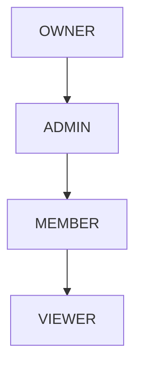

# 🏢 Enterprise Multi-Tenancy & RBAC Architecture Specification

This specification documents the multi-tenant organizational structure, workspace permissions hierarchy, and team-shared template governance in **MailGenie**.

---

## 1. Role-Based Access Control (RBAC) Hierarchy



### Permission Capability Matrix

| Capability | OWNER | ADMIN | MEMBER | VIEWER |
| :--- | :---: | :---: | :---: | :---: |
| **Manage Billing & Plans** | ✅ | ❌ | ❌ | ❌ |
| **Delete Workspace** | ✅ | ❌ | ❌ | ❌ |
| **Invite / Remove Members** | ✅ | ✅ | ❌ | ❌ |
| **Publish Organization Templates** | ✅ | ✅ | ❌ | ❌ |
| **Create Personal Templates** | ✅ | ✅ | ✅ | ❌ |
| **Generate AI Email Replies** | ✅ | ✅ | ✅ | ❌ |
| **View Shared Templates** | ✅ | ✅ | ✅ | ✅ |

---

## 2. API Endpoints

- `POST /api/team-templates/{orgId}` — Create and publish approved organizational template (Requires `PUBLISH_GLOBAL_TEMPLATE`).
- `GET /api/team-templates/{orgId}` — List all organization templates.

---

## 3. Audit Logging & Compliance Event Schema

All security-critical actions generate immutable audit log events:

```json
{
  "eventId": "evt-8f92a4e1",
  "orgId": "org-acme-corp",
  "actorUserId": "usr-admin-101",
  "action": "TEMPLATE_PUBLISHED",
  "resourceId": "tmpl-enterprise-outreach-v2",
  "ipAddress": "192.168.1.50",
  "timestamp": "2026-08-25T13:20:00Z"
}
```

