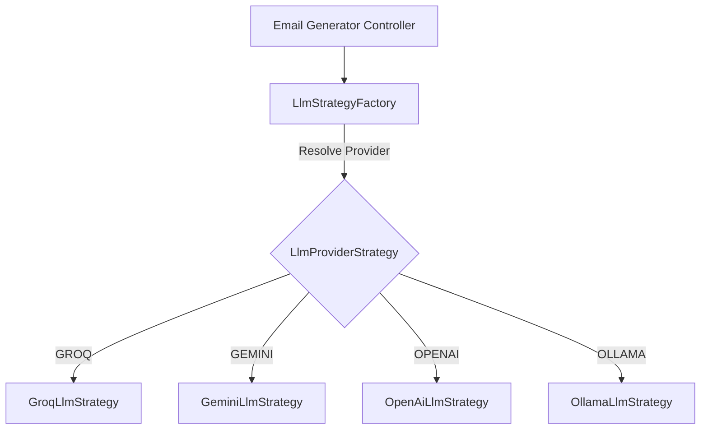

# 🧠 LLM Provider Agnostic Adapter Architecture

This document describes the extensible Adapter and Strategy design pattern implemented in MailGenie to support multiple AI backends (Groq, Google Gemini, OpenAI, and Local Ollama).

---

## Architecture Overview

### Adding New AI Providers

To integrate a new LLM provider (e.g. Anthropic Claude, Mistral):
1. Implement the `LlmProviderStrategy` interface in `com.email.writer.service.llm`.
2. Annotate the class with `@Service`.
3. The Spring DI container will automatically discover and register it into `LlmStrategyFactory`.
