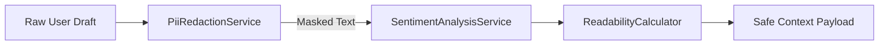

# 🛡️ PII Sanitization & Tone Scoring Architecture

This document specifies the pre-flight Personally Identifiable Information (PII) redaction and real-time sentiment analysis engine implemented in **MailGenie**.

---

## 1. Pipeline Flow

### Redaction Rules
- **SSN:** `\b\d{3}-\d{2}-\d{4}\b` → `[REDACTED_SSN]`
- **Credit Cards:** Visa, MasterCard, Amex patterns → `[REDACTED_CREDIT_CARD]`
- **Secret Keys:** `sk-*`, `ghp_*`, `api_key_*` → `[REDACTED_SECRET_KEY]`

---

## 2. Sentiment Scoring Index & Formality Thresholds

- **Formality Score (0–100):** Weighted by passive voice constructions, academic vocabulary, and formal salutations.
- **Politeness Index (0–100):** Evaluated against affirmative polite particles ("please", "appreciate", "kind regards").
- **Readability Index:** Flesch Reading Ease formula computed per paragraph to guarantee standard business reading ease.

---

## 3. Compliance Integration

This pre-flight filter ensures strict adherence to GDPR Article 32 and HIPAA Privacy rules by zeroing out accidental transmissions of customer identifiers.

