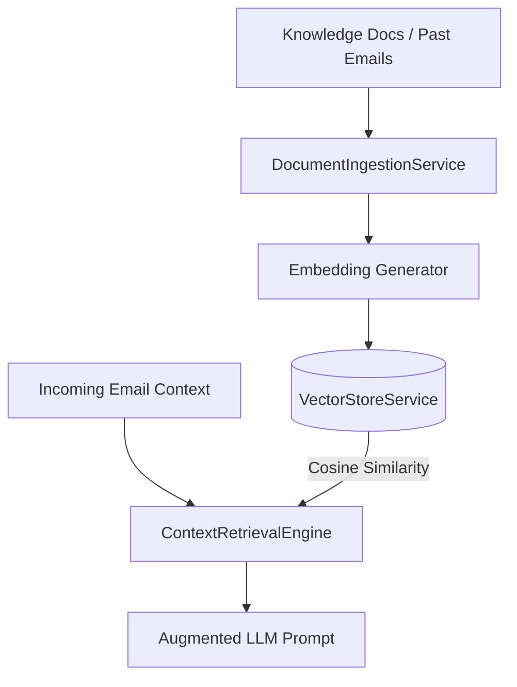

# 🧠 Retrieval-Augmented Generation (RAG) Architecture & Vector Pipeline

This document details the semantic knowledge retrieval and vector search pipeline implemented in **MailGenie**.

---

## 1. Pipeline Overview

### Components

1. **`VectorStoreService`:** In-memory high-dimensional vector store supporting cosine similarity ranking.
2. **`DocumentIngestionService`:** Sliding-window text chunker (200 words, 50 word overlap) generating 128-dim embeddings.
3. **`ContextRetrievalEngine`:** Prompt assembler dynamically merging top-K semantic matches into LLM prompt envelopes.
4. **`KnowledgeBaseController`:** REST API endpoints (`/api/rag/ingest`, `/api/rag/stats`) for tenant document uploads.
