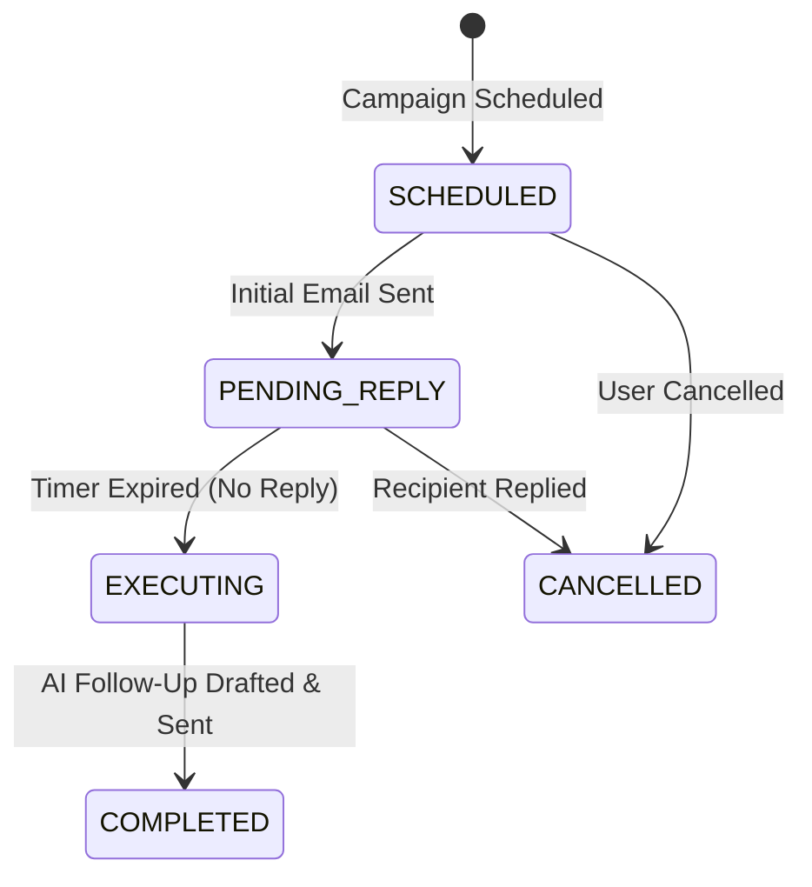

# ⏱️ Distributed Job Scheduling & Follow-Up Campaign Specification

This document details the architecture of the **Automated Follow-Up Campaign Engine** in MailGenie.

---

## 1. Sequence State Transitions

### Key API Endpoints
- `POST /api/campaigns/schedule` — Queues a delayed sequence.
- `GET /api/campaigns/active` — Lists all scheduled sequences.
- `DELETE /api/campaigns/{id}` — Cancels an in-flight campaign sequence.

---

## 2. Distributed Locking & Execution Guarantees

In multi-instance production environments, `FollowUpSchedulerService` acquires Redis-backed distributed locks (`SETNX`) to ensure that exactly one backend worker processes each due follow-up without duplicate emails being dispatched to customers.

---

## 3. Failure Handling & Exponential Backoff

If an upstream LLM provider fails during scheduled execution, the sequence status transitions to `PENDING_RETRY` with exponential backoff (15m, 1h, 4h) up to 3 retry attempts.

