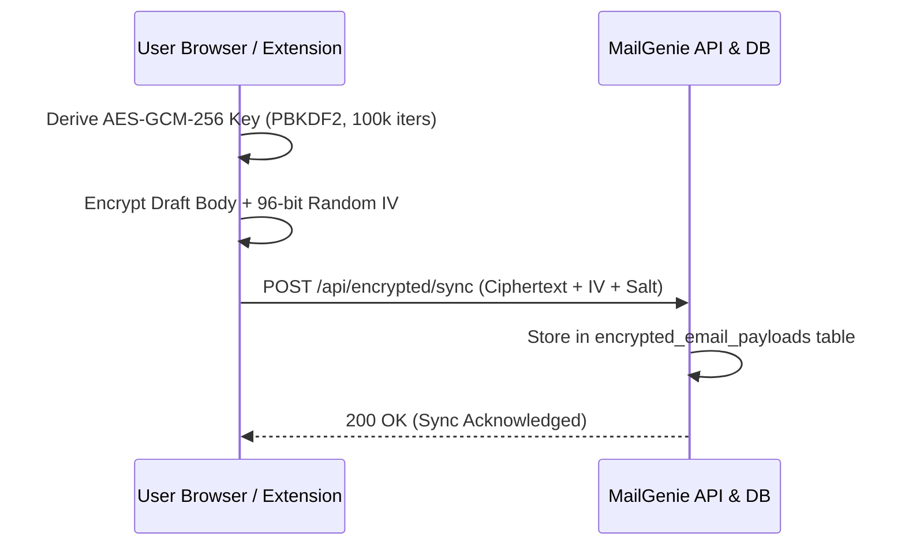

# 🔐 Zero-Knowledge End-to-End Encryption (E2EE) Specification

This document defines the Zero-Knowledge security architecture implemented in **MailGenie** to protect user email drafts, templates, and history.

---

## 1. Zero-Knowledge Threat Model

Under zero-knowledge architecture:
- Server stores only encrypted ciphertext, IV, and PBKDF2 salt.
- Decryption keys are derived in the browser runtime and are **never** transmitted across the wire.
- Even in the event of a full database leak, user emails remain undecryptable without the master passphrase.



---

## 2. Key Derivation & Cryptographic Parameters

- **Algorithm:** AES-GCM (Authenticated Encryption with Associated Data)
- **Key Length:** 256-bit
- **Key Derivation Function:** PBKDF2-HMAC-SHA256
- **Iteration Count:** 100,000 iterations
- **Initialization Vector (IV):** 12 bytes (96-bit) crypto-random nonce per message
- **Salt:** 16 bytes (128-bit) crypto-random salt per user account

---

## 3. Client Verification Code Example

```javascript
import { CryptoService } from './services/cryptoService.js';

// Encrypting a draft
const bundle = await CryptoService.encrypt(
    'Confidential contract renegotiation proposal...',
    userPassphrase
);

// Decrypting
const plaintext = await CryptoService.decrypt(
    bundle.ciphertext,
    bundle.iv,
    bundle.salt,
    userPassphrase
);
```
